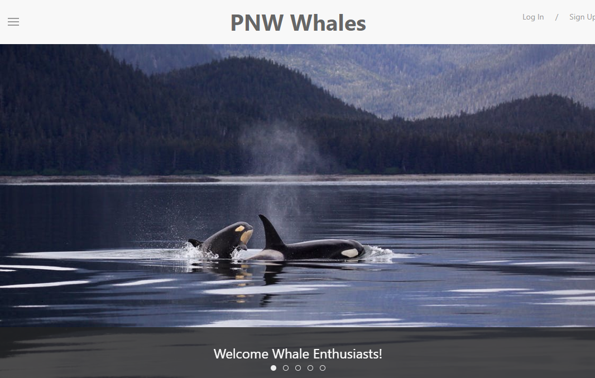

# PNW Whale Watching

Be notified of local whale sightings and, if you're one of the lucky ones, be able to post your own and share with others.

## Table of Contents

1. [Usage](#Usage)
1. [Languages and Concepts](#Languages-and-Concepts)
1. [Demo](#Demo)
1. [Roadmap](#Roadmap)
1. [Links](#Links)
1. [Contact](#Contact)
1. [Contributing](#Contributing)
1. [License](#License)

## Usage

This application allows users to be notified when whales are spotted in the area by having an account through the site. Users post sightings to the page and notifications are sent via text to the other users. There is also information about local organizations in the area that aim to improve the lives of our local whale population.   

## Languages and Concepts

- [Node.js](https://nodejs.org/en/)
- [Express.js](https://expressjs.com/)
- [Passport.js](http://www.passportjs.org/)
- [Handlebars.js](https://handlebarsjs.com/)
- [UIKit](https://getuikit.com/)
- [Sequelize](https://sequelize.org/)
- [MySQL](https://www.mysql.com/)
- [Mapbox API](https://docs.mapbox.com/api/overview/)

## Demo

## Roadmap

Along the way we had many ideas come into mind that we would like to incorporate: a linter like ES Lint; Travis CI; using a custom pin whale icon on the map; a single overview map that displays all the sightings listed; add filters to view results by whale, time period, location, or view own posts; manage user account - allow users to edit their information, change their password, change notification settings, and delete their user account; add notifications via email (user choice) and allow users to specify locations they want to hear about; user can upload images to their posts which also load to a gallery page; add login via Facebook/Google/Twitter; add user data to user profile - a badge to show how many posts they've made; add verification system so users can verify other's post if they see the same whale(s); add error messages - if input is left blank or if email/password is incorrect at login.

## Links

- [See it live!](http://www.pnwwhalewatch.com/)
- [Project Repository](https://github.com/watchNW/whale-watching)

## Contact

- Dan Cornutt - [@dancornutt](https://github.com/dancornutt)
- Girma - [@girmaD](https://github.com/girmaD)
- Olga Illarionova - [@Myau5x](https://github.com/Myau5x)
- Nicole Marshall - [@ncmarsh](https://github.com/ncmarsh)

## Contributing

This is a personal project; no contributions are required at this time.

## License

No license granted.

##### [Return to Top of Page](#PNW-Whale-Watching)